#  Flask Student Registration Web Application (CI/CD Deployment)

##  Project Overview

This project is a **Flask-based Student Registration Web Application** that allows users to register student details through a web form. The application stores the submitted data in a **MySQL database** and displays success confirmation after registration.

The project demonstrates **end-to-end DevOps workflow**, including version control, continuous integration, and deployment using **GitHub, Jenkins, and AWS EC2**.

The goal of this project is to understand:

* Flask web application development
* Form handling in Python
* Database integration with MySQL
* Version control using Git & GitHub
* CI/CD pipeline using Jenkins
* Cloud deployment on AWS EC2

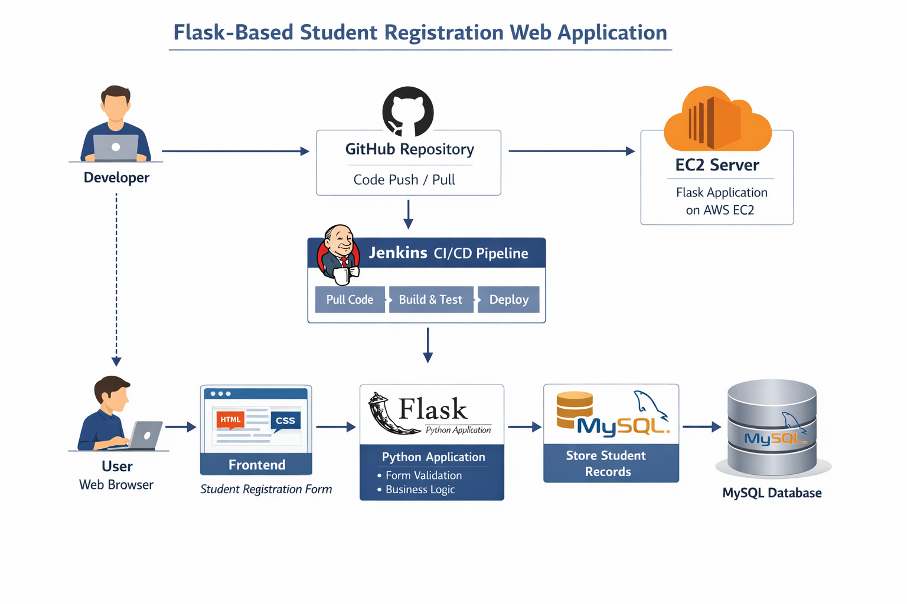
---

#  System Architecture

Below is the high-level architecture of the application:

```
           User (Browser)
                 │
                 ▼
         Frontend (HTML/CSS)
                 │
                 ▼
        Flask Web Application
            (Python Flask)
                 │
                 ▼
           MySQL Database
         (Student Records)

------------------------------------

        Developer
             │
             ▼
       GitHub Repository
             │
             ▼
        Jenkins Pipeline
        (Build & Deploy)
             │
             ▼
          AWS EC2
      (Flask Application)
```

**Workflow Explanation**

1. User fills the **student registration form**
2. Flask processes the request
3. Data is stored in **MySQL database**
4. Jenkins automatically deploys the application
5. Application runs on **AWS EC2 server**

---

#  Technology Stack

| Layer           | Technology   |
| --------------- | ------------ |
| Frontend        | HTML, CSS    |
| Backend         | Python Flask |
| Database        | MySQL        |
| Version Control | Git & GitHub |
| CI/CD           | Jenkins      |
| Cloud           | AWS EC2      |

---

#  Features

✔ Student Registration Form
✔ Form validation
✔ Data stored in MySQL database
✔ Success message after submission
✔ GitHub version control
✔ Jenkins automated build pipeline
✔ Deployment on AWS EC2

---

#  Project Structure

```
stud-reg-flask-app
│
├── app.py
├── requirements.txt
├── templates
│     └── index.html
│
├── screenshots
│
└── README.md
```

---

#  Setup Instructions (Local Setup)

## 1.  Clone Repository

```
git clone https://github.com/Iamnehapawar/stud-reg-flask-app.git
```

---

## 2. Navigate to Project

```
cd stud-reg-flask-app
```

---

## 3. Create Virtual Environment

```
python -m venv venv
```

---

## 4. Activate Virtual Environment

Windows

```
venv\Scripts\activate
```

Linux / Mac

```
source venv/bin/activate
```

---

## 5. Install Dependencies

```
pip install -r requirements.txt
```

---

## 6. Run Application

```
python app.py
```

Application will run on:

```
http://127.0.0.1:5000
```

---

#  Database Setup (MySQL)

Create database:

```
CREATE DATABASE studentsdb;
```

Use database:

```
USE studentsdb;
```

Create table:

```
CREATE TABLE students (
id INT AUTO_INCREMENT PRIMARY KEY,
name VARCHAR(100),
email VARCHAR(100),
phone VARCHAR(20),
course VARCHAR(50),
address VARCHAR(255)
);
```

---

#  Jenkins CI/CD Pipeline

The project uses **Jenkins for automated deployment**.

### Jenkins Workflow

1. Jenkins pulls latest code from GitHub
2. Installs Python dependencies
3. Runs Flask application
4. Deploys application on EC2 instance

Example Jenkins build step:

```
cd /var/lib/jenkins/workspace/flask-student-app
python3 -m venv venv
source venv/bin/activate
pip install -r requirements.txt
pkill -f app.py || true
nohup python app.py &
```

---

#  Deployment on AWS EC2

Steps followed:

1. Launch EC2 instance
2. Install Python, pip and Git
3. Install Jenkins
4. Configure Jenkins job
5. Deploy Flask application
6. Access application using public IP

Example:

```
http://65.0.203.239:5000
```

---

#  Project Screenshots

## 1. Git Clone Repository

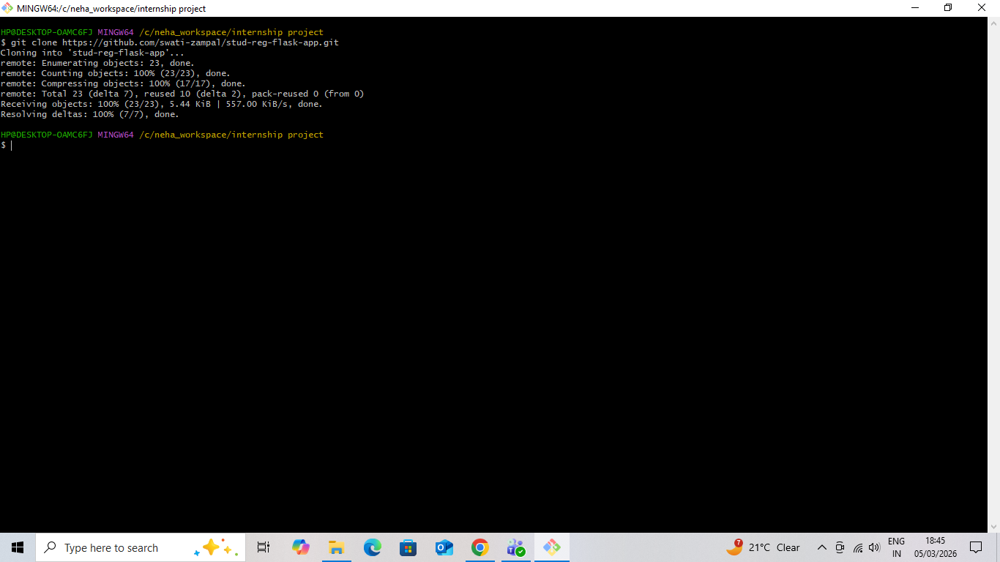

---

## 2. Installing Dependencies

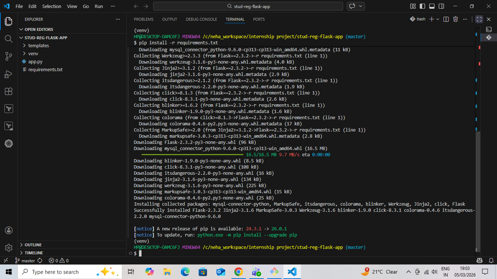

---

## 3. Student Registration Success

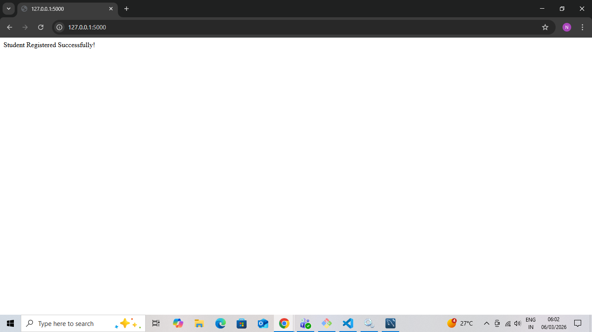
---

## 4. MySQL Database Records

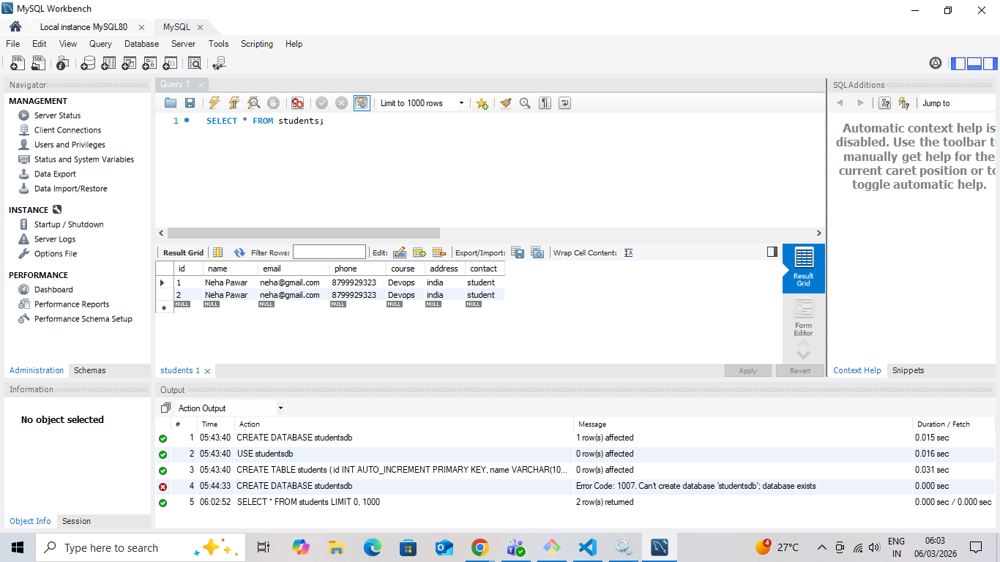
---

## 5. GitHub Commit History

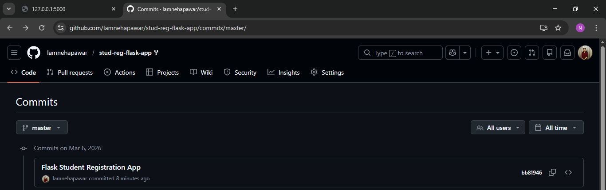

---

## 6. EC2 Dependency Installation

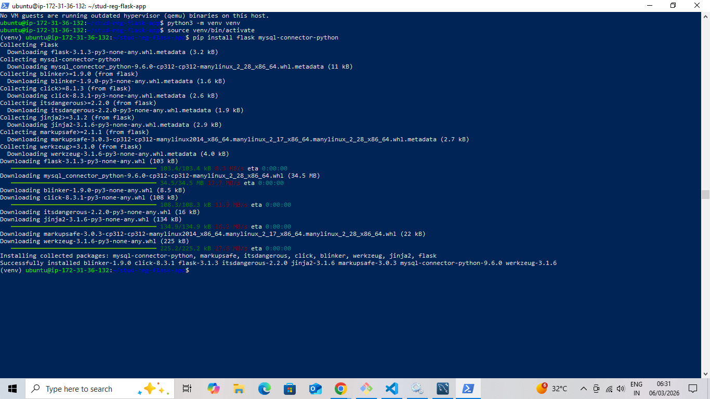

---

## 7. Jenkins Dashboard

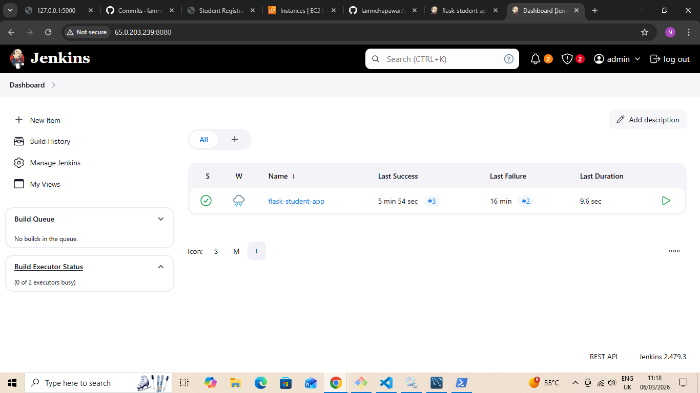

---

## 8. Live Application on EC2

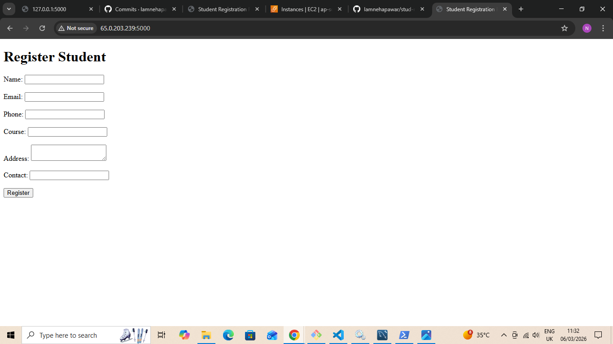

---

## 9. Jenkins Build Success

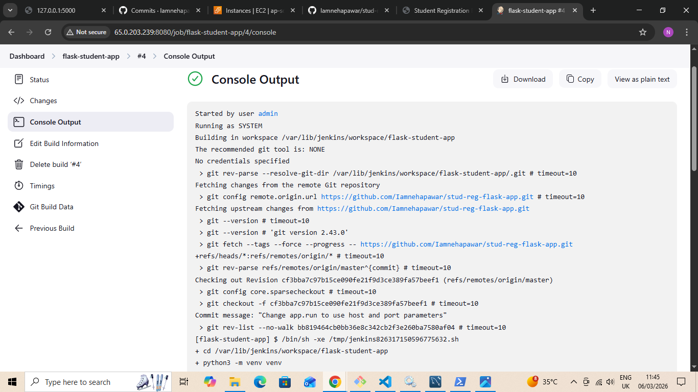
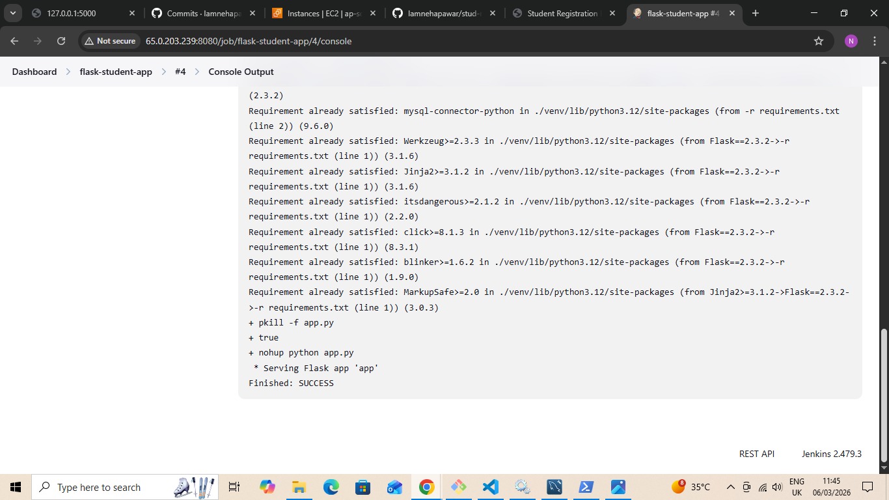
---

## 10.  AWS EC2 Instance Running

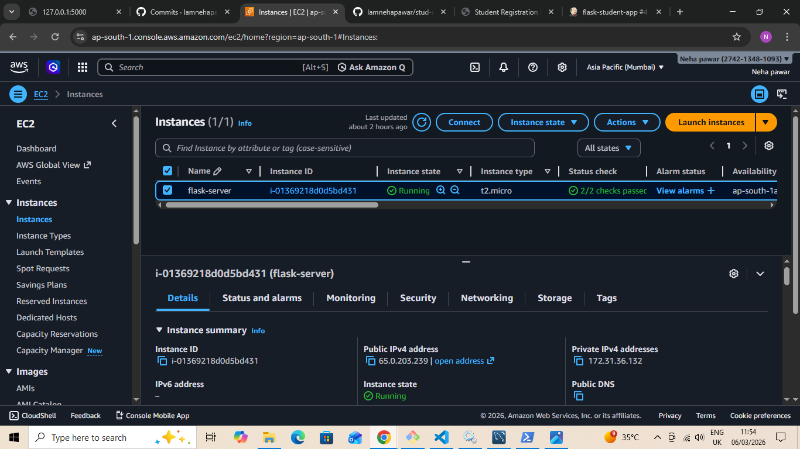

---

#  Learning Outcomes

Through this project, I gained hands-on experience in:

* Flask web development
* Python backend development
* Database integration with MySQL
* Git & GitHub version control
* CI/CD pipeline with Jenkins
* Cloud deployment using AWS EC2

---

#  Author

**Neha Pawar**

Aspiring DevOps Engineer | Cloud Computing Enthusiast | CI/CD Learner

GitHub: https://github.com/Iamnehapawar

Medium Blog: https://medium.com/@nehapawar29005

LinkedIn: https://www.linkedin.com/in/neha-pawar-3ba4a131b

---

